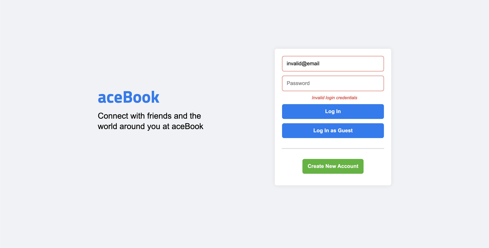
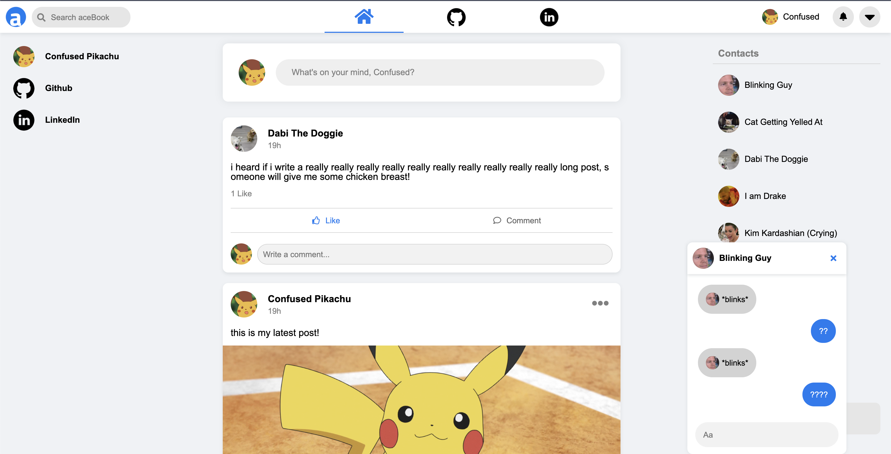
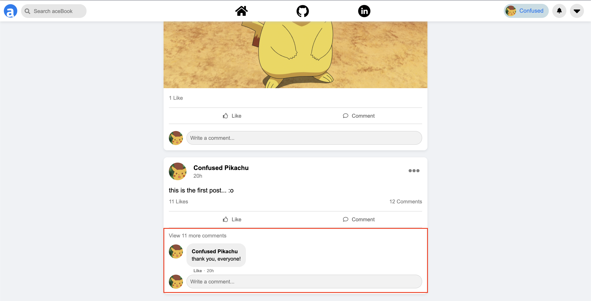
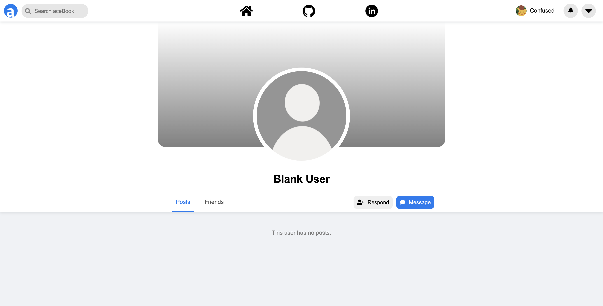
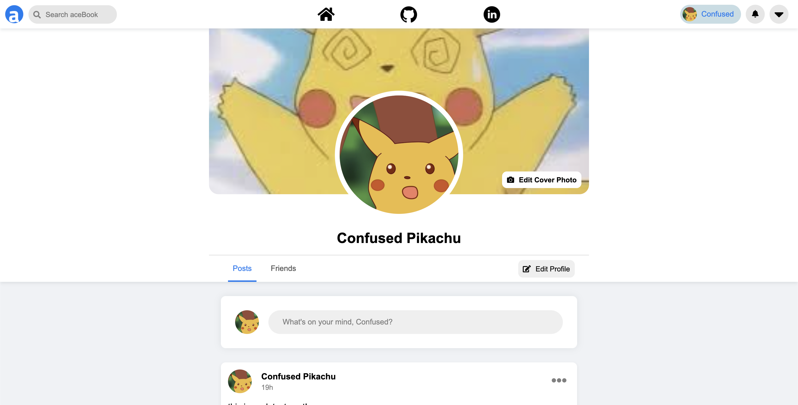
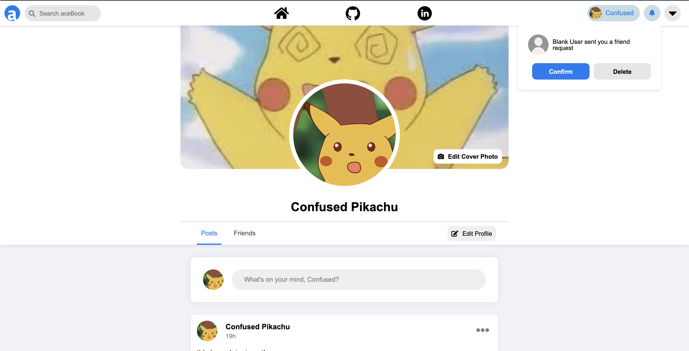
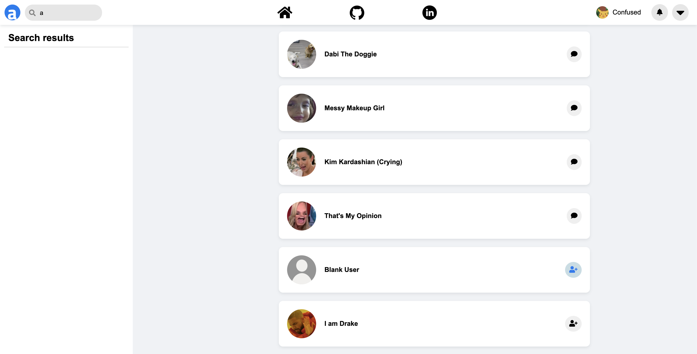

# aceBook


[aceBook](https://skang-acebook.herokuapp.com/#) is a Facebook clone. It is a social media platform where users can create unique, individual profiles that best represent themselves, and use these profiles to connect with other users on the app. Once a user is set up, they are able to create text or image content via posts that will be shared with their friends list. Users can also interact with the posts of their friends by liking or commenting.


## Technologies Used
aceBook was implemented using React, Redux, Ruby on Rails, Heroku, and AWS3.

## Key Features
### User Auth
* Users must have an account and be logged in in order to access aceBook



### Newsfeed 
* Once logged in, Users are directed to the newsfeed where they are able to scroll through the posts of their friends along with their own posts, which are ordered by the time that they were created
    * The current user will have the option to edit or delete any posts or comments that they have made
* The newsfeed also hosts a list of contacts that includes all of the current users' friends
    * Clicking on a particular friend will open a live chat with that user, either creating a new chat or loading a pre-existing chat
```
componentDidMount() {
    App.cable.subscriptions.create(
        { channel: "ChatChannel", chat_id: this.props.chat.id},
        {
            received: data => {
                this.props.receiveMessage(data.message)
            },
            speak: function(data) {
                return this.perform("speak", data)
            }
        }
    );
}
```



### Comment Section
* Each post will have a comment section, that will dynamically update based on the amount of comments it has
    * On page load, the comment section will preview the latest comment if it has more than one, and include a link to expand the comment section to show all comments
    * Regardless of the comment section length, a user will be able to dynamically add a new comment and have it render on the page once it has been saved



### Profiles
* All profiles will host that particular user's profile picture (if applicable), cover photo (if applicable), along with a post scroll that will show both the posts the user has made, as well as posts that their friends have made directly onto their profile
    * When the current user navigates to another users profile, there will be a button for the current user to open or start a chat with that user
    * There will also be another button that dynamically update depending on the current users friend relationship with that user (i.e. incoming friend request that hasn't been responded to yet, outgoing friend request that hasn't been responded to yet, current friends, etc.)
    * The form to post on a users wall will also appear dynamically, based on the current users friend relationship with that user



```
if (this.props.friends.some(friend => friend.friend_id === this.props.user.id && friend.user_id == this.props.currentUser.id && friend.status === true)) {
    friendButton = <button onClick={this.handleDropDownClick}>
        {this.props.buttonType === "profile" ? <i className="fas fa-user-check"></i>: null}
        <span>Friends</span>
    </button>

    friendButtonDropdown = <div className="friend-request-content" id={`friend-request-content-${this.props.user.id}`}>
        <div>
            <button onClick={this.handleDeleteFriendRequest}>
                {this.props.buttonType === "profile" ? <i className="fas fa-user-minus"></i> : null}
                <span>Unfriend</span>
            </button>
        </div>
    </div>
} else if (this.props.friends.some(friend => friend.friend_id === this.props.user.id && friend.user_id == this.props.currentUser.id && friend.status === false)) {
    friendButton = <button id="cancel-button" onClick={this.handleDeleteFriendRequest}>
        {this.props.buttonType === "profile" ? <i className="fas fa-user-minus"></i> : null}
        <span>Cancel Request</span>
    </button>
} else if (this.props.friends.some(friend => (friend.friend_id === this.props.currentUser.id && friend.user_id === this.props.user.id && friend.status === false))) {
    friendButton = <button id="respond-button" onClick={this.handleDropDownClick}>
        {this.props.buttonType === "profile" ? <i className="fas fa-user-plus"></i> : null}
        <span>Respond</span>
    </button>

    friendButtonDropdown = <div className="friend-request-content" id={`friend-request-content-${this.props.user.id}`}>
        <div>
            <button onClick={this.handleUpdateFriendRequest}>Confirm</button>
            <button onClick={this.handleDeleteFriendRequest}>Delete request</button>
        </div>
    </div>
} else if (!(this.props.friends.some(friend => friend.friend_id === this.props.user.id && friend.user_id === this.props.currentUser.id && friend.status === true))) {
    friendButton = <button id="add-friend-button" onClick={this.handleCreateFriendRequest}>
        { this.props.buttonType === "profile" ? <i className="fas fa-user-plus"></i> : null}
        <span>Add Friend</span>
    </button>
}
```

* If a user is viewing their own profile, there will be a button for them to edit their information



### NavBar
* The Navigation Bar will persist throughout the app, and provides buttons for the user to respond to any incoming friend requests, navigate to the newsfeed or their profile, search the app for its users, and logout of the app




### Search
* The search bar will redirect users to the search feature, which will show a list of users within the app whose names match the searched term
    * Each item in the search results will show a button depending on the current users friend relationship with them, similarly to user profiles


